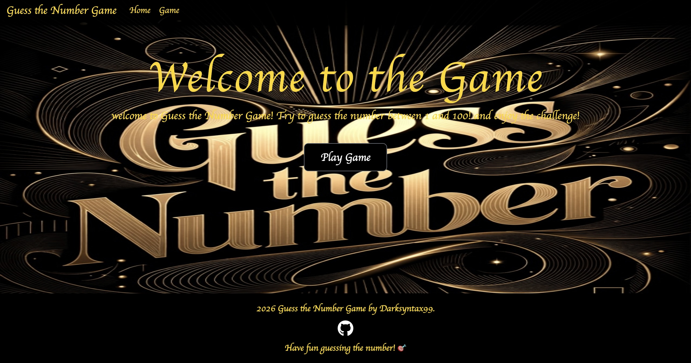
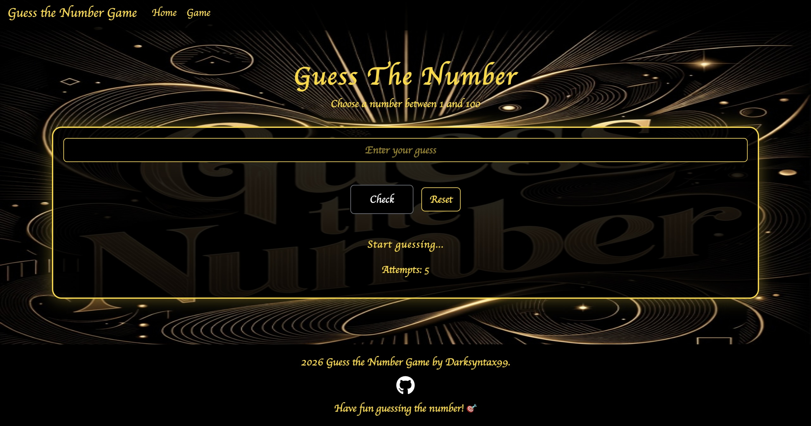
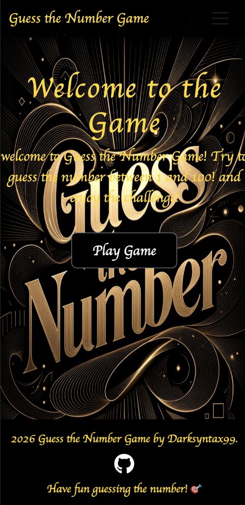
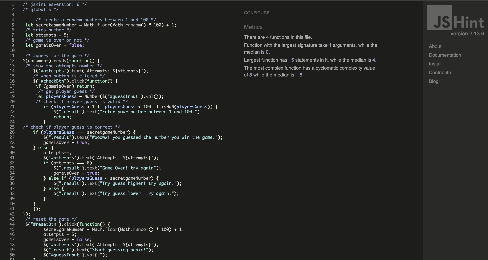
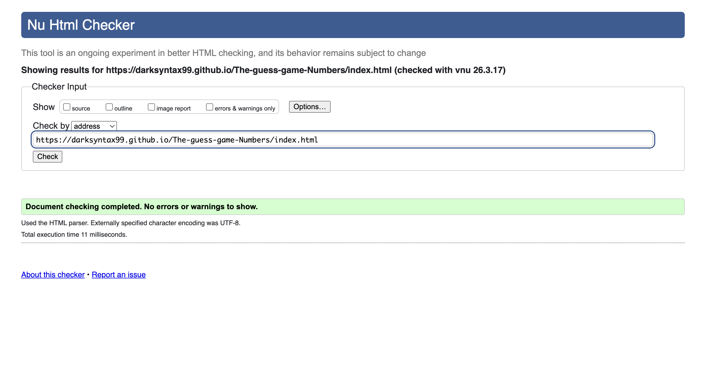
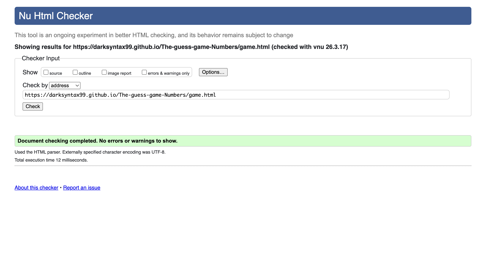
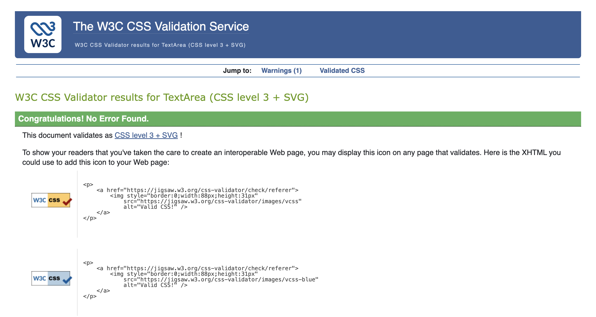

# The-guess-game-Numbers
Guess the Number Game is an interactive web game where players try to guess a randomly generated number between 1 and 100.
The players receives feedback afetr each guess indicating whether the guess is try higher or try lower. The game also tracks the number of attempts remaining. 
This project demonstrates the use of HTML, CSS and JavaScriprt to create an interactive front-end web application. 
[the,game,link](https://darksyntax99.github.io/The-guess-game-Numbers/index.html)

## Features Section 

Everything explained is shown in the pictures for check it.
- Navigation bar 
on all the pages the navigation bar includes links to Home and game page.
so this allows the users to move easily between the pages.

- Home page 
the home page include welcome message with short description of the game and it also has the "Play Game" button that talkes the user directly to the game so its quick accses to start the game.

- Game page 
the game page includes 
input field to enter the number 
check button to submit the guess
reset button to restart the game 
and shows feedback messages (Try guess higher! try again.) (Try guess lower! try again.) and track number of attempts.

- Game logic 
The game generates a random number between 1-100
the user has limited attempts (5)attempts to guess the correct number
after guessing the game gives feedback and updates the attempts counter.

- Footer and social link
the footer appears on all the pages 
it includes a github icon that links to my project respository and this allows users to view the source code and connect with me.

## Testing Approach 
- Testing for this project was carried out using both manual and automated methods to ensure functionality and usability.
## Manual Testing 
Manual testing involves testing the application by interacting with it as a user. This method was used to check the functionality and user experience of the game.

| Feature           | Expected Outcome                    | Action                                                                    | Result                   |
| ----------------- | ----------------------------------- | ------------------------------------------------------------------------- | ------------------------ |
| Navbar            | Page navigates correctly            | 1. Click Home link 2. Click Game link                                | Works as expected / pass |
| Play Button       | Navigates to game page              | 1. Click "Play Game" button on Home page                                  | Works as expected / pass |
| Input Field       | Accepts valid numbers               | 1. Enter number between 1 and 100                                         | Works as expected / pass |
| Input Validation  | Shows message for invalid input     | 1. Enter number less than 1 or greater than 100  2. Enter empty input | Works as expected / pass |
| Check Button      | Displays correct feedback           | 1. Enter a number 2. Click "Check"                                   | Works as expected / pass |
| Game Logic        | Shows correct result (high/low/win) | 1. Enter different guesses                                                | Works as expected / pass |
| Attempts Counter  | Decreases after each wrong guess    | 1. Enter wrong guesses multiple times                                     | Works as expected / pass |
| Game Over         | Stops game when attempts reach 0    | 1. Use all attempts                                                       | Works as expected / pass |
| Reset Button      | Resets the game                     | 1. Click "Reset" button                                                   | Works as expected / pass |
| Enter Key         | Submits guess using keyboard        | 1. Enter number  2. Press Enter                                       | Works as expected / pass |
| GitHub Icon       | Opens link in new tab               | 1. Click GitHub icon in footer                                            | Works as expected / pass |
| Responsive Layout | Layout adapts to screen sizes       | 1. Resize browser (Desktop, Tablet, Mobile)                               | Works as expected / pass |

### Automated Testing
Automated testing involves using tools to validate code without manual interaction.
## Validators
all HTML, css and Javascript passed without errors

[Js,test] 

[HTML,home,test](https://validator.w3.org/nu/?doc=https%3A%2F%2Fdarksyntax99.github.io%2FThe-guess-game-Numbers%2Findex.html)

[HTML,game,test](https://validator.w3.org/nu/?doc=https%3A%2F%2Fdarksyntax99.github.io%2FThe-guess-game-Numbers%2Fgame.html)

[css,test](https://jigsaw.w3.org/css-validator/validator)

## Testing When each was used 
Manual testing was always used throughout development to test user and functionality.
Automated testing was often used to validate the code and ensure it before deployment.

## Technologies Used 
- Languages and editor
1. HTML
2. CSS
3. JavaScript
4. Vscode
- Libraries and Tools 
1. Balsamiq to create the wireframe
2. Bootstrap v5.1.3
3. Google fonts 
4. chrome devTools for debugging the code and check the site 
5. i used also WC3 validator, Jisgaw W3 validator Jshint Lighthouse.
6. fontawesome for github icon 
7. jquery 

## Browser and device test

1. Desktop (≥1024px): Chrome, Firefox, Safari
2. Tablet (768px): Chrome, Safari
3. Mobile (≤375px): Chrome, Safari

Lighthouse (chrome Devtools)
- Best Practices :100
- Accessibility: 92
- Performance: 95
- SEO:90

## Deployment 
this section describe the process to deploy the project to a hosting platform -github(pages)- 
the site deployed github pages followed by this steps

1. Navigate to github repository: The-guess-game-Number
2. than click on the setting
3. scroll to the page section 
4. click on source and select the main branch
5. last step click save the page will refresh automatically and willl appear to indicate the deployment was successful and the live site will be accessed here [The,guess,number,game](https://darksyntax99.github.io/The-guess-game-Numbers/)

## bugs/fixes 

1. Bug  - Navbar HTML Structure Error

Issue: HTML validator showed errors related to <nav> and list elements.

Cause: The <body> tag was closed before the navbar, and <li> elements were incorrectly nested.

Fix: Moved the <nav> inside the <body> and corrected the <ul>/<li> structure.

2. Bug - Bootstrap CSS Validation Errors

Issue: W3C CSS Validator showed multiple errors.

Cause: Errors originated from Bootstrap CDN, not custom CSS.

Fix: No fix required, as these are known issues with external libraries and do not affect functionality.

3. Bug - Undefined Variables (JSHint)
Issue: JSHint reported undefined variables (secretgameNumber, attempts, gameisOver).

Cause: Variables were declared inside $(document).ready() but used outside of it.

Fix: Moved variable declarations to the global scope at the top of the file.

4. Bug  - ES6 Syntax Warning
Issue: JSHint showed warnings for let and modern JavaScript syntax.

Cause: ES6 was not enabled in JSHint configuration.
Fix: Added the following line:

/* jshint esversion: 6 */

5. Bug  — Game continues after winning

Issue: Player could still enter guesses after winning the game.

Cause: No condition to stop the game after win.

Fix: Added gameisOver variable to stop the game when player wins or loses

6. Bug  – jQuery $ is not defined

Issue: JSHint shows a warning that $ is not defined.

Cause: JSHint doesn’t automatically know that jQuery is being used.

Fix: Add this line at the very top of your JavaScript file to tell JSHint that $ exists: 
/* global $ */

## User Experience (UX)

- User Story 1: Start the Game

As a user I want to easily start the game so that I can begin playing without confusion

Acceptance Criteria -

1. I need a clear (Play Game) button on the home page.
2. When I click the button, I should be taken to the game page.
3. When I click the button, I should be taken to the game page.

- User Story 2: Enter a Guess

As a user, I want to enter a number guess so that I can try to find the correct number

-Acceptance Criteria-

1. I need an input field where I can enter a number.
2. The number should be between 1 and 100
3. The input field should be easy to find and use

User Story 3: Receive Feedback

As a user I want to receive feedback after each guess so that I know if my guess is correct, too high or too low.

-Acceptance Criteria-

1. The game should display a message after each guess.
2. The message should indicate if the guess is Too High or Too Low.
3. If the guess is correct, the game should display a success message.

User Story 4: See Remaining Attempts

As a user I want to restart the game so that I can play again without refreshing the page.

-Acceptance Criteria-

1. There should be a Reset button.
2. When I press Reset, the game should generate a new random number.
3. The number of attempts should return to the starting value.

User Story 5: Restart the Game

As a user, I want to restart the game so that I can play again without refreshing the page

-Acceptance Criteria-

1. There should be a Reset button.
2. When I press Reset, the game should generate a new random number.
3. The number of attempts should return to the starting value.

## Wireframes
[Home,section,desktop]
 

[Game,section,desktop]

[Home.section.tablet]

[Game,section.tablet]

[Home,section,mobile]

[Game,sectio.mobile]

## Development Cycle 
- Planning Phase 
i started by defining the project goal, which was to build an interactive number guessing game.
i identified the target users and created simple user stories to guide the development
- Design Phase 
i created wireframes for the Home and Game pages using Balsamiq The focus was on simplicity and clear layout for the player. 
- Development Phase 
i built the game using HTML CSS and Javascript Bootstrap was usedfor responsive layout 
i wrote the code Vscode and used google fonts and Fontawesome for styling icons.
- Tested Phase 
I tested the game manually on different screen sizes and browsers.
I also used HTML and css validators, jshint and Lighthouse to check performance, accessibility, and best practices. 
- debugging & Improvements
I fixed some problems in the game, such as:
attempts counter not updating
Reset button not working properly
I also fixed small style problems and made thDe messages.

## Deployment and Run locally
1. Clone the project open terminal and type git clone
(https://github.com/Darksyntax99/The-guess-game-Numbers.git)
2. open the project folder cd The-guess-game-Numbers
3. Run the project open the project and open index.html it can be open by double click the file or using live server in Vscode.
4. Live server i used t if we are using Vscode install live server and right click on index.html then we just click open and it will be in the browser what we need internet browser(Chrome,safari,Firefox) 
[web,of,game,guess,number](https://darksyntax99.github.io/The-guess-game-Numbers/index.html)

5. serve with python (i used it ) open the terminal/run python -m http.server 8000 the we get this link to open at browser 
[link,local](http://localhost:8000/index.html)

## credits

- Content and design inspiration
the goal of the number guessing game project was to create a simple and interactive and responsive web game that focuses on user experience and fun.

- Game interface and layout
I followed the principle of "less is more" and i always following this principle with my projects 
to make the game interface simple and user-friendly
. input fields buttons and feedback messages are clearly defined
and easy to use across all devices (Desktop, tablet, mobile)

- LIbraries and Tools Used
1. jQuery i used it to facilitate interaction with HTML elements, such as handling button clicks, inputting values, and dynamic text updates in the game.

2. Bootstrap – i used used it to make the website responsive across different devices (desktop, tablet, mobile) quickly and easily, while providing ready-made formats for elements such as buttons, containers, and menus.

3. Google Fonts - i  used it to apply clear and attractive fonts to the game pages, improving the user experience and making the text easier to read.

4. Font Awesome –i used it for  GitHub icon in the footer, to facilitate linking to the project and add a good design touch.

About AI (copilot) I used AI during the development of this project strictly as a learning tool.
improve understanding of lighthouse. All code in this project was written, adapted, and fully understood by me. No AI-generated code was copied directly into the project
AI was only consulted in specific situations to help identify issues (for example to understand JavaScript logic, including jQuery usage or DOM manipulation.)
so all the code in this project is written, modified, and fully understood by me. No AI-generated code was directly copied into the project any guidance from AI was followed by manual implementation and personal verification I remain fully responsible for the project’s structure, code decisions, and final implementation. 
